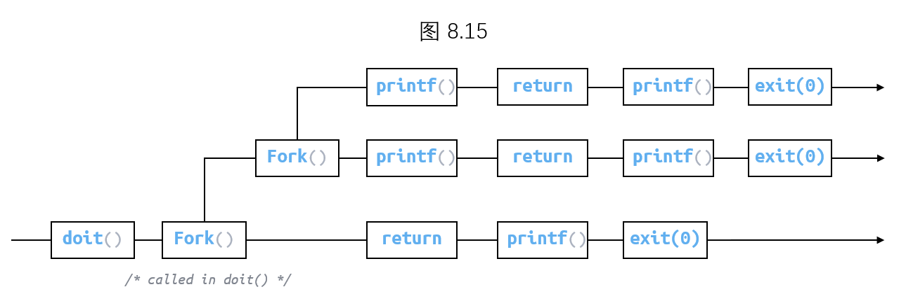
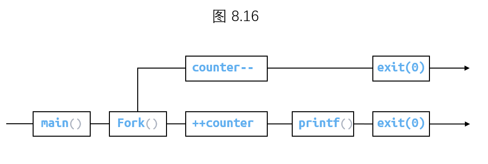
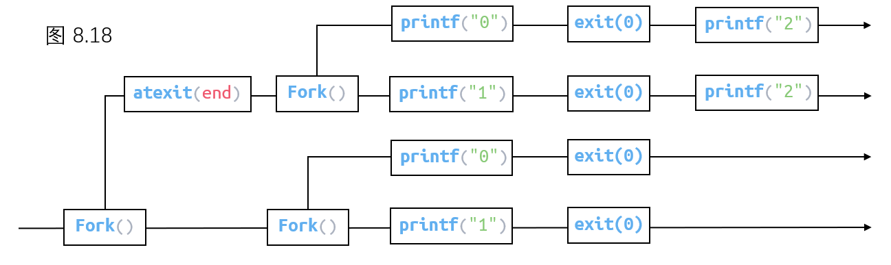
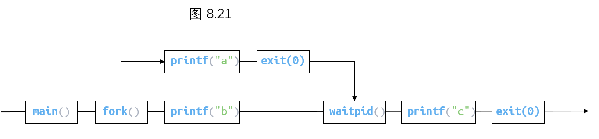

# Homework Week14

## 8.10

A. 调用一次，返回两次 `fork`
B. 调用一次，从不返回 `longjmp` `execve`
C. 调用一次，返回一次或多次 `setjmp`

## 8.15

共 5 个输出

## 8.16

`counter = 2`

子进程拷贝父进程的栈数据，但不会影响父进程

## 8.18

A.112002
C.102120
D.100212

由进程图可得，每个 `2` 前至少有一个 `0` 或 `1`
故 B. D. 不可能出现

## 8.21

由进程图可知，`printf("c")` 需等待子进程结束，故 `c` 一定在 `a` 的后面输出，而 `a` 和 `b` 之间没有联系

在父进程中 `c` 本就在 `b` 的后面输出

所以可能的序列有 `abc` 和 `bac`
