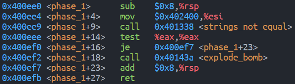
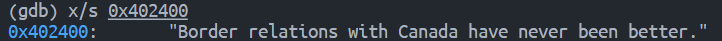
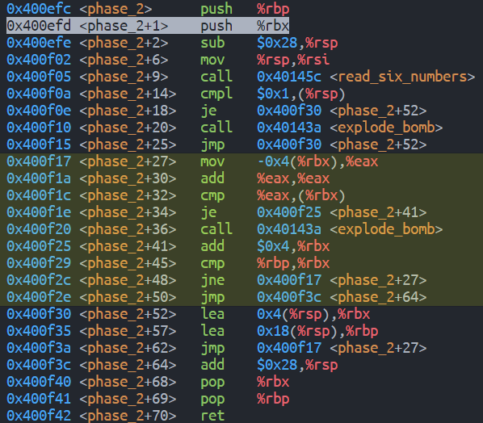
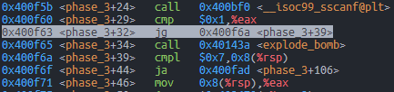
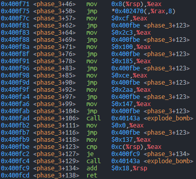
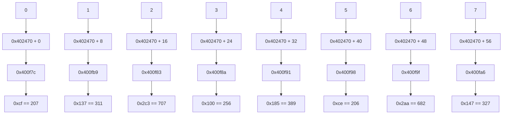

# Lab2

## Phase 1

看到 `phase_1` 的 `explode_bomb` 在 `0x400ef2` 行，需要通过 `0x400ef0` 行的 `je` 控制语句来跳过

`je` 语句使用上一行的 `test` 语句，`test` 返回操作数本身，故需要让 `%eax` 为 `0`，`%eax` 一般是上一个函数（本题中即为 `string_not_equal`）的返回值。猜测该函数是检测两个字符串是否不相等，本题需要让它们相等，其中一个参数通过标准输入，另一个则是由上一行的 `mov $0x402400, %rsi` 传入

因此，需要让输入的字符串与 `0x402400` 处的字符串相等，使用 `x/s 0x402400` 查看 `0x402400` 处的字符串，得到结果

**Phase1: Border relations with Canada have never been better.**

## Phase 2

在 `0x400f05` 行读入 6 个数字，记作 `a[0]` 至 `a[5]`。`0x400f0a` 与 `0x400f0e` 两行要求栈顶 `%rsp` 也就是 `a[0]` 为 1. 当满足 `a[0] == 1` 时，`jmp` 至 `0x400f30` 进行初始化 `%rbx = %rsp + 0x4, %rbp = %rsp + 0x18`，分别表示 `a[1]` 和 `a[6]` 的地址，然后进入 `0x400f17` 与 `0x400f3a` 之间的循环部分（图中黄色区域）
`0x400f17`, `0x400f1a`, `0x400f1c` 三行实现了将 `*(%rbx - 4)` 的两倍与 `*(%rbx)` （也就是将 `%rbx` 对应数组元素与它的前一项的两倍）的比较，`0x400f1e` 行若比较结果不相等则引爆炸弹，因此需要比较结果相等，`0x400f25` 在每次比较后将 `%rbx += 4`，即比较下一项。`0x400f29` 在 `%rbx == %rbp (== $rsp + 0x18)` （即到达数组末尾）时结束循环，最终 `return`

综上，`phase_2` 实现检测一个长度为 6 的数组，以 `1` 开头，且每一项是前一项的两倍

**Phase2: 1 2 4 8 16 32**

## Phase 3

`0x400f5b` 行至 `0x400f71` 行输入至少两个数字，并将第一个数字（经过多次不同输入测试得出，这两个数字的存放位置不在栈顶，而是栈顶下 `8` 字节与 `12` 字节处）存入 `%eax` 且保证第一个数字是不大于 `7` 的非负数。

`0x400f75` 根据输入的第一个数字的值，获取对应地址处（具体为 `0x402470 + 8 * %rax`）存放的另一个值，并间接跳转到该值存储的地址处，可以注意到，`jmp` 间接跳转的目标地址都是其下方某个 `mov` 指令的地址，`mov` 将某个值存入 `%eax` 中后再 `jmp` 至 `0x400fbe` 处做“输入时的第二个数字”和“刚刚存入的数值”的比较，如果相同则跳过成功。

综上，可以总结为 `phase_3` 中存有 `7` 对数对（第一个由上文保证是不大于 `7` 的非负数，第二个由 `jmp` 到的具体地址得到），如果输入的两个数字与其中的某个数对相同即可成功。

通过不同的尝试得到的对应关系如下

任意输入其中一对即可，例如 `3 256`

**Phase3: 0 207 || 1 311 || 2 707 || 3 256 || 4 389 || 5 206 || 6 682 || 7 327**

## Phase 4