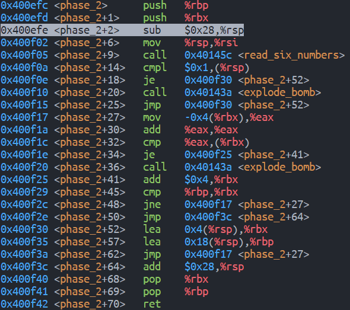

# Lab2

## Phase 1


看到 `phase_1` 的 `explode_bomb` 在 `0x400ef2` 行，需要通过 `0x400ef0` 行的 `je` 控制语句来跳过

`je` 语句使用上一行的 `test` 语句，`test` 返回操作数本身，故需要让 `%eax` 为 `0`，`%eax` 一般是上一个函数（本题中即为 `string_not_equal`）的返回值。猜测该函数是检测两个字符串是否不相等，本题需要让它们相等，其中一个参数通过标准输入，另一个则是由上一行的 `mov $0x402400, %rsi` 传入

因此，需要让输入的字符串与 `0x402400` 处的字符串相等，使用 `x/s 0x402400` 查看 `0x402400` 处的字符串，得到结果


**Phase1: Border relations with Canada have never been better.**

## Phase 2



在 `0x400f05` 行读入 6 个数字，记作 `a[0]` 至 `a[5]`。`0x400f0a` 与 `0x400f0e` 两行要求栈顶 `%rsp` 也就是 `a[0]` 为 1. 当满足 `a[0] == 1` 时，`jmp` 至 `0x400f30` 进行初始化 `%rbx = %rsp + 0x4, %rbp = %rsp + 0x18`，分别表示 `a[1]` 和 `a[6]` 的地址，然后进入 `0x400f17` 与 `0x400f3a` 之间的循环部分（图中黄色区域）
`0x400f17`, `0x400f1a`, `0x400f1c` 三行实现了将 `*(%rbx - 4)` 的两倍与 `*(%rbx)` （也就是将 `%rbx` 对应数组元素与它的前一项的两倍）的比较，`0x400f1e` 行若比较结果不相等则引爆炸弹，因此需要比较结果相等，`0x400f25` 在每次比较后将 `%rbx += 4`，即比较下一项。`0x400f29` 在 `%rbx == %rbp (== $rsp + 0x18)` （即到达数组末尾）时结束循环，最终 `return`

综上，`phase_2` 实现检测一个长度为 6 的数组，以 `1` 开头，且每一项是前一项的两倍

**Phase2: 1 2 4 8 16 32**

## Phase 3


`0x400f5b` 行至 `0x400f71` 行输入至少两个数字，并将第一个数字（经过多次不同输入测试得出，这两个数字的存放位置不在栈顶，而是栈顶下 `8` 字节与 `12` 字节处）存入 `%eax` 且保证第一个数字是不大于 `7` 的非负数。


`0x400f75` 根据输入的第一个数字的值，获取对应地址处（具体为 `0x402470 + 8 * %rax`）存放的另一个值，并间接跳转到该值存储的地址处，可以注意到，`jmp` 间接跳转的目标地址都是其下方某个 `mov` 指令的地址，所有 `mov` 之后都会到达 `0x400fbe` 处的 `cmp` （包括 `jmp` 至的和恰好顺序执行到的）

综上，可以总结为 `phase_3` 中生成了一个 `switch-case` 所需要的跳转表，不同的 `case` 对应不同的另一个数字，如果输入的两个数字在 `switch-case` 中存在匹配的组合则通关

通过数次的尝试得到的对应关系如下


任意输入其中一对即可，例如 `3 256`

**Phase3: 0 207 || 1 311 || 2 707 || 3 256 || 4 389 || 5 206 || 6 682 || 7 327**

## Phase 4


首先读入恰好两个整数（若不为两个则引爆炸弹）存入 `$rsp + 8` 和 `$rsp + 16`，且保证第一个数是不大于 `14` 的非负数

将 `%edx` `%esi` `%edi` 分别初始化为 `14` `0` `*($rsp + 8)` 后进入函数 `func4`，得到函数返回值 `%eax`，检查 `%eax` 是否为 `0`，若不为 `0` 则引爆，后检测 `*(%rsp + 12)` （也就是输入的第二个数字）与 `0` 是否相等，若相等则跳过引爆（即输入的第二个数字如果不等于 `0` 则引爆），则重点在于 `func4` 中的内容


`0x400fd2` 至 `0x400fdf` 进行了如下操作，（使用 c 格式表示，注释内代入初始化的数值）:
```c
%eax = %edx - %esi                      //( == 14 - 0 == 14)
%ecx = %eax                             //( == 14)
%eax = %eax + ((unsigned)%ecx >> 31)    //( == 14 + (14 >> 31) == 14)
%eax = %eax >> 1                        //( == 14 >> 1 == 7)
%ecx = %rax + %rsi                      //( == 7 + 0 == 7)
```
比较 `%edi`（输入的第一个数字）与 `%ecx (== 7)`，如果 `7 <= %edi` 则跳转至 `0x400ff2`

在 `0x400ff2` 令 `%eax = 0` 后比较 `%ecx (== 7)` 与 `%edi` 如果 `7 >= %edi` 则跳转至 `0x401007`

至此函数跳过了其中全部的递归调用直接返回，同时 `%eax` 恰为所需要的 `0`，因此只需要使 `%edi >= 7` 且 `%edi <= 7` 即可直接通过 `func4`，而 `%edi` 即是输入的第一个数字，因此输入的第一个数字只需为 `7` 即可

同时可以注意到输入的第二个数字 （位置在`%rsp + 12`） 始终不受影响，因此其始终不变，由上文可知它应为 `0`。

综上可得到该阶段可行的一个答案

**Phase4: 7 0**

## Phase 5


经查阅了解从 `0x40106a` 至 `0x401073` 部分是保证程序鲁棒性的安全措施，不影响解题，故忽略。

程序核心部分从 `0x401078` 开始，首先检测输入的字符串长度（从 `string_length` 函数的名称可猜测得出，需要为 `6`。

在 `0x401089` 处跳转至 `0x4010d2` 将 `%eax` 置零再回到 `0x40108b` 进入 `0x40108b` 至 `0x4010ac` 之间的循环，其中 `%rax` 作为循环变量从 `0` 至 `5`，当到达 `6` 时结束循环

循环体：
将 `(%rbx + %rax)` 地址处的变量存入 `%ecx`，将 `%cl` （`%ecx` 的低 `8` 位）存入栈顶和 `%rdx` 中并保留后者的低 `4` 位。
取 `(0x4024b0 + %rdx)` 地址处的值替换掉 `%rdx`，再将它的低 `8` 位存入 `(%rsp + %rax + 16)` 的地址处。
其中 `%rbx` 是输入的字符串的首地址，`%rax` 是循环变量，`%ecx / %cl` 和 `%rsp` 作为中间变量。

以上循环体实现以下功能，将 `*(%rbx + %rax)` 的数值取低 `4` 位（即对 `16` 取模），记作 `temp`，取 `*(0x4024b0 + temp)` 处的数值存入栈顶下 `(16 + %rsp)` 字节处。由于 `%rax` 是从 `0` 至 `5` 的自变量，因此会对整个字符串执行如上操作。最终整个字符串会变为另一个串保存。

查看 `0x4024b0` 处的字符串可以推测出转换规则。

`0x4010ae` 在保存的新串后添加结束符 `'\0'`。

`0x4010b3` 和 `0x4010b8` 分别将 `0x40245e` 的某个串与输入串转换后的新串作为参数传入下面的 `strings_not_equal` 函数，若相等则 `je` 至 `0x4010e9` 结束函数，成功拆弹。

查看 `0x40245e` 处的串。

发现我们要让输入串转变为 `"flyers"`

查看 `0x4024b0` 处的串。

由于转换式有对 `16` 取模操作，转换只需要前 `16` 个字符 `"maduiersnfotvbyl"`。其余字符串是在程序执行过程中输入 `Ctrl + C` 时的提示语，与本题无关。

在串中找到 `"flyers"` 分别在 `9` `15` `14` `5` `6` `7` 处。由前面的转换规则：“输入字符对 `16` 取模”，需要输入 `6` 个对 `16` 取模后分别为这些数值的字符，查询 `ASCII` 码表得到


如上对应关系，第二行的每个框中各选择一个字符即可，例如：

**Phase5: ionefg**

## Phase 6

Phase 6 较为复杂，分为四个阶段

***Phase 6 Part 1***


以上部分首先读入 `6` 个数字，做 `%r14 = %rsp` 和 `%r12d = 0` 的初始化后，进入 `0x401114` 至 `0x401151` 内的双层循环，其中外层循环的循环变量为 `%r12d`，从 `1` 至 `5`，当到达 `6` 时 `je` 至 `0x401153` 结束双循环。若循环变量不为 `6` ，在 `0x401132` 将 `%rbx` 初始化为外层循环变量 `%r12d` 的值后，`%rbx` 作为内层的循环变量进入 `0x401123` 至 `0x40114b` 的内层循环，范围为 `%r12d` 至 `5`，当超过 `5` 时结束内层循环，将 `%r13 += 4` （即指向下一个输入的 `int` 变量，`%r13` 在程序开始被初始化为 `%rsp` ，截图中没展示）后进入外层的下一层循环。

内层循环中，循环变量首先初始化为外层循环变量的数值，然后进行如下操作：
1. 循环变量 `%ebx` 存入 `%rax` 
1. 做赋值 `%eax = *(%rsp + %rax * 4)`，其中 `%rax` 等于 `%ebx`。即计算栈顶下 `%ebx * 4` 字节处的地址中的值，也就是输入的第 `%ebx` 个数字（编号从 `0` 开始），将其存入 `%eax`
1. 比较 `%eax` 与 `*(%rbp)`，若相同则引爆炸弹，它们不能相同。
1. 循环变量自增 `1`，若自增后大于 `5`，结束内层循环并将 `%r13 += 4`，否则回到步骤 1

由于 `%rbp` 保持不变，`%eax` 从 `%r12d` 至 `5`，因此会将第 `%r12d` 至第 `5` 个数字分别与 `%rbp` 存的地址处的数字比较，保证它们不同

外层循环，将 `%r12d` 初始化为 `0` 后执行如下操作：
1. 将 `%r13` 存入 `%rbp`，以及它存储的地址处的数字存入 `%eax`。
1. 该数字减 `1` 后与 `5` 无符号比较，若数字不大于 `5`，否则跳过炸弹，因此需要减 `1` 后的数字不大于 `5`，也即不减少的数字（输入的原数字）在 `1` 到 `6` 之间。
    1. 若原数小于等于 `0`，减 `1` 后的数字的无符号解释显然会大于 `5` 不符合要求，所以减 `1` 后的无符号比较可以保证输入为正.
    1. 在该步骤完成后 `%eax` 不再作为源操作数，因此它不会影响其它操作，所以在这里仅仅用于检查输入的范围。
1. 将 `%r12d` 自增 `1`，若到达 `6` 则结束外层循环，否则将自增后的 `%r12d` 存入 `%rbx`，这是内层循环变量的初始化，进入内层循环

注意到以下事实：
1. 第一次进入内层循环时，`%rbp` 从栈顶也即从 `0` 开始，而`%r12d` 从 `1` 开始，内层循环中的比较是栈顶数字与其下方的每个数字（当然，不超过全部的 `6` 个数字）比较，比较不包括自己，也就保证不会出现自己等于自己而引爆炸弹的情况
1. 其后每一次进入内层循环前，`%r13` 与 `%r12d` 同步增长，因为其中前者在前一次内层循环结束后自增，后者在下一次开始前自增。
1. 在每次外层循环时，都有 `%rbp = %r13`，而 `%rbp` 不在其它地方改变，因此等价于 `%rbp` 与 `%r12d` 的同步增长 
1. 实现了这样的操作，`%rbp` 从栈顶开始，`%r12d` 从它下面一个开始，将第 `0` 个数字与第 `1...5` 个分别比较，保证互不相同；二者同步自增至下一个变量，将第 `1` 个数字与 `2...5` 个分别比较。

综上 `0x401106` 至 `0x401151` 实现了输入 `6` 个数字，范围在 `1` 至 `6` 之间，互不相同

***Phase 6 Part 2***


将栈顶下 `6` 个 `4` 字节的地址存入 `%rsi`，并将 `%rax` 初始化为 `%r14`（`0x40110b` 处将 `%r14` 初始化为 `%rsp`，截图中未展示），也就是将 `%rax` 初始化为栈顶地址，以及将 `%ecx` 初始化为 `7`。之后进入 `0x401160` 至 `40116d` 之间的循环：

执行 `%edx = %ecx (== 7)`，将 `7` 减去 `*(%rax)` 并存回到 `%rax`，`%rax += 4` 指向下一个变量，直至 `%rax` 指向 `6` 个 `int` 后的下一字节。

这一部分实现了将输入的 `6` 个数字原地对 `7` 取补的操作，如将 `1` 转换为 `6`，`4` 转换为 `3`，`6` 转换为 `1` 等。

***Phase 6 Part 3***


进入后首先初始化 `%esi = ` 后跳转到 `0x401197`

在此处将栈顶下 `%rsi` 字节处的数字存入 `%rcx`，注意到这一部分 `%rsi` 作为目标操作数只有 `0x40118d` `0x401191` 两行，根据它们的内容可以得出 `%rsi` 表示数组索引，由于变化量是 `4`，下文中以 `i` 代指 `%rsi / 4` 表示数组索引。于是这一行的指令可以表示为 `%ecx = a[i] /* a 表示输入的数组 */`

之后检查 `%ecx`，若它小于等于 `1`，`jle` 至 `0x401183` 将 `%edx` 赋值为 `0x6032d0`，并将这个地址本身存入 `0x20 + %rsp + 2 * i` 的地址中。

注意到有且仅有 `0x401188` 这一行对栈顶下 `0x20` 个字节之后的位置有操作，且形式和上文中的数组类似，不妨认为在这个位置有另一个数组，记为 `b`，它的首地址是 `0x20 + %rsp`，而索引 `%rsi` 以 `4` 为变化量，这里的目标操作数比例因子为 `2`，所以数组 `b` 元素大小为 `8` 字节。另外，可以发现它的源操作数 `%rdx` 是地址，所以这是一个指针数组。变址与数组 `a` 相同，所以可以使用相同的索引 `i`。

这时重新从 `0x401197` 分析。将 `a[i]` 存入 `%ecx`：
1. 若它小于等于 `1`，将`0x6032d0` 存入 `b[i]`。
2. 若大于 `1`，令 `%eax` 初始化为 `1`，`%edx` 初始化为 `0x6032d0`，进入 `0x401176` 至 `0x40117f` 的循环，`%eax` 是循环变量
    1. 将 `%rdx` 改为它存储的地址 `+ 8` 后的地址指向的位置存储的值。
    2. `%eax ++`，若与 `%ecx` 相等结束循环，否则回到步骤 i。
    3. 结束循环后，将此时的 `%rdx` 的值存入 `b[i]`

可以得出结论，`0x6032d0` 开始有一个链表，每个结点的 `+ 0` 的位置是数值，`+ 8` 的位置是下一个结点的地址。链表结点结构如下：
```c
typedef struct Node{
    long data;
    Node* next;
};
```

这一部分则是根据 `a` 数组中的值 `a[i]`，取链表中第 `a[i]` 个值，存入 `b[i]` 中。
等价地说，将 `a` 按原顺序存入 `b` 中（原本 `4` 字节变 扩展为 `8` 字节）。对 `b` 的每个元素 `b[i]` 的值，以这个值为索引找到在链表中对应结点，用结点的**地址**替换。

链表内容如下


***Phase 6 Part 4***


可以看出 `0x4011bd` 至 `0x4011d0` 是一个循环，循环变量 `%rax` 初始化为 `b` 数组**第二个元素**的地址即 `b + 1`，终止条件即指向 `b` 数组末尾。同时初始化 `%rbx` 和 `%rcx` 为 `b[0]`（循环中不使用 `%rbx`）：
1. 赋 `%rdx` 为 `*(%rax)` 即 `b[1]`
2. 将 `%rdx` 复制到 `(0x8 + %rcx)` 位置处，
    1. 此时 `%rcx` 是 `b[0]`，是链表中某个结点的地址。
    2. `8 + %rcx` 是这个结点的后继指针，即它指向的下一个结点的地址
    3. 将它替换为 `%rdx` ，即用 `b[1]` 替换 `b[0]` 结点的后继指针。
3. `%rax += 8`，`%rcx = %rdx`，即让 `%rax` 指向 `b` 数组的下一个元素的所在地址（此时为 `b + 2`），`%rcx` 则是下一个元素本身（`b[1]`），这一步是循环的递增，分别让两个变量在 `b` 数组上递增。
4. 重复 1 2 两步（索引使用递增后的新的索引）

循环结束后，`%rdx` 为 `b[5]`，`0x4011d2` 行保证链表结尾指空
综上这个循环重排链表，使链表按照 `b` 数组的顺序排列。

之后，将 `%ebp` 初始化为 `5`，进入 `0x4011df` 至 `0x4011f5` 之间的循环，此时 `%rbx` 仍为 `b[0]`：
1. `%rbx` 初始状态的 `%rbx` 是 `b[0]`，是链表中某个结点的地址，`%rbx + 8` 则是这个结点的指针域，`mov` 可以将 `%rbx + 8` 解引用，将内容存入 `%rax`，此时 `%rax` 内就是前一结点的后继结点的地址
2. 再对 `%rax` 自身解引用，因为 `%rax` 内是后继结点的地址，解引用后就是后继结点的 `data`
3. 将其与 `(%rbx)` 比较，`%rbx` 是前一结点的地址，解引用后就是前一结点的 `data`，所以这一步会将相邻两个结点的 `data` 作比较
4. 若 `(%rbx)` 大于或等于 `%eax` 则跳过 `explode_bomb`，所以需要前一结点的数据大于或等于后继结点的数据。
5. 将 `*(8 + %rbx)` 存入 `%rbx`，作用类似于第 i 步，将结点更新为后继节点
6. 重复操作直到 `%ebp` 到达 `0`，此时 `%rbx` 也到达链表结尾，没有后继节点

综上，这个循环要求链表中的结点的数据按照降序排序

***Phase 6 Conlusion***
因此只需要获取到链表中的所有结点（并按序编号 `1 ~ 6`）的数据，以降序重排。

使 `a` 数组中为排序后的顺序（的结点编号）即可，即 `3 4 5 6 1 2`
但同时，由于函数会将输入的数组对 `7` 取补，因此需要输入预先对 `7` 取补后的数组。
对应地应输入

**Phase 6: 4 3 2 1 6 5**

## Secret Phase

### Entrance

在汇编文件中，`phase_6` 函数后有 `func7` 和 `secret_phase`，说明存在隐藏关，首先寻找进入的方法。

直接用编辑器（例如 VSCode）打开汇编文件，使用 `Crtl + F` 查找 `secret_phase`，发现在每次拆弹后的 `phase_defused` 函数中有调用该函数，因此分析 `phase_defused`。


`0x4015d8` 行将某寄存器与 `6` 比较，且有注释标识 `num_input_strings`，猜测是指输入过的字符串的总个数，如果不等于 `6` 则直接 `jne` 到 `0x40163f` 结束函数，所以必须要总共输入 `6` 个串之后才可能进入隐藏关。
由于每一关对应一个字符串，所以至少要完成前面全部六关。

`0x4015f0` 行开始，以 `0x402619` 和 `0x603870` 作为参数调用输入函数，
查看这两个参数

前者为 `scanf` 函数的格式化参数，表示输入两个整数和一个字符串，
后者恰好为 `Phase4` 的输入，因此可能这里会重新读入 `Phase4` 的输入。

`0x4015ff` 比较返回值是否为 `3`，如果不为 `3` 则`jne` 至 `0x401635`，`0x401635` 处会输出字符串 `0x402558`，使用 `gdb` 查看后得到 `"Congratulations! You've defused the bomb!"`，这正是完成实验的提示语，之后退出程序。

`scanf` 的返回值是成功读入的数据个数，因此需要让这个函数读入三个串。
前两个分别是 `Phase4` 本身的解 `7 0`，第三个输入会作为参数，与 `0x402622` 处的串进入 `strings_not_equal` 函数，如果两个串相同，会输出两个提示词，进入 `secret_phase`。

查看该串

所以要在 `Phase4` 的输入后添加 `DrEvil`
即

**`7 0 DrEvil`**

### Solution


将 `%edx` 初始化为 `10`，`%esi` 为 `0`，并使输入转换成整数，存入 `%rbx`，减 `1` 后存入 `%eax`。
如果减 `1` 后的数无符号比较小于等于 `0x3e8` 则跳过 `explode_bomb`，这里与 `Phase6` 的 `0x40111b` 至 `0x401121` 部分类似，保证输入为正。所以这里保证输入是不大于 `0x3e9` 的正数。

将 `%ebx`（输入的数字）和 `0x6030f0` 作为参数进入 `fun7`，在 `fun7` 中运算后如果返回值 `%eax` 为 `2`，则跳过 `explode_bomb`，完成隐藏关。查看 `0x6030f0` 处的值


以下为 `func7`:


如果参数 `%rdi` 为 `0` 则 `je` 至 `0x401238` 结束 `fun7`，此时显然不为 `0`。

注意到：
1. 在 `0x40121c` 行会使 `%eax` 加 `%eax`，即 `%eax = %eax * 2`。
2. 在 `0x401220` 行会使 `%eax` 置零，即 `%eax = 0`。
3. 在 `0x401232` 行会计算 `0x1 + %rax + %rax * 1` 存入 `%eax`，即将 `%eax = %eax * 2 + 1`
4. 除置零操作外，其余两个操作都会直接 `jmp` 到函数末尾返回。而置零操作后在 `%edx == %esi` 条件下也会返回。

如果希望以 `2` 作为返回值。可以以 `%eax = 0   -->   %eax = %eax * 2 + 1   -->   %eax = %eax * 2` 的顺序执行。

由于函数递归调用类似栈操作，所以要先在 `%eax` 翻倍前第一次递归调用，再在翻倍加一前第二次调用，同时第一次返回前使 `%eax` 置零，这样即可做到，1. `%eax` 置零 2. 第一次返回后加一 3. 第二次返回后翻倍 4. 完全返回。使 `%eax` 最终为 `2`。

希望到达 `0x401217`，不能满足 `%edx <= %esi`，其中 `%edx` 在 `0x40120d` 行赋值为 `*(%rdi) (== 36)`，所以输入要小于 `36`，之后 `%rdi` 更新为它存储的地址 `+ 8` 的位置的值（这里与 `Phase6` 类似，同样为一个链表）

这个地址的值是 `0x8`。

第一次递归调用 `func7`，这次需要到达 `0x401220`，也就要使 `%edx // (== *(%rdi) == 8)` 小于等于 `%esi`，输入应当大于等于 `8`。但是如果相等，会在 `0x401227` 处跳转到函数末尾，没能使 `%rax` 加一，不合要求，所以不能相等。

`%rdi` 直接更新为 `+ 16` 的位置存储的地址（`0x603150`，值为 `0x16`），第二次调用。

这次希望直接返回。同样使 `%edx = *(%rdi) // (== 0x16)` 后：
注意到如果 `%edx <= %esi`，可以 `jle` 到 `0x401220`（在这里使 `%eax` 置零不影响结果），如果还有 `%edx == %esi` 可以 `je` 到 `0x40123d`，这正是满足了直接返回的要求。
此时的 `%edx` 就是 `0x16`，可以发现如果让输入为 `22`，可以同时满足上述 `%rsi <= 36` `%rsi > 8` `%rsi == 22` 的要求。

这时函数就会以预想的位置和顺序递归调用，也会以预想的顺序返回，完成递归，最终 `%eax == 2`，完成 `Phase7`

所以需要输入
**secret_phase: 22**
