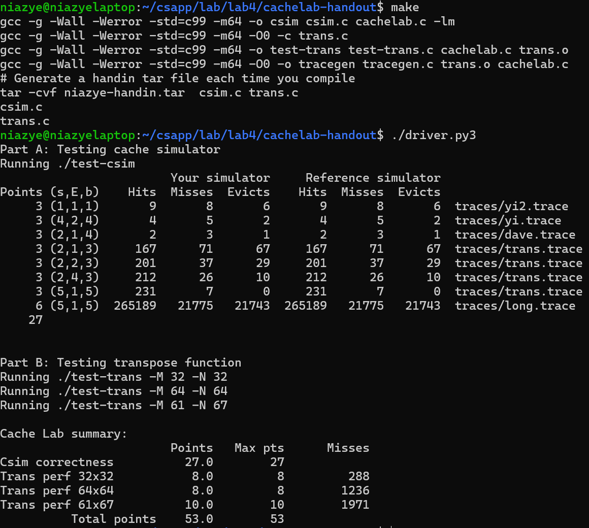

# Lab4

## 结果截图

{width=60%}

## Part A 高速缓存模拟

给出实例程序 `csim-ref` 并模拟它的行为。
即根据不同的参数实现对应的高速缓存行为的模拟，通过数个样例来判断

参数解析使用库函数 `optarg` 进行处理，具体见 `csim.c` 代码。

其中包括对错误输入进行处理，
`verbose` 变量控制是否输出详细信息
（尽管测试样例不对此做要求）

使用结构体模拟一个缓存行，二维数组模拟整个缓存，行表示组，列表示组中的行。

```c
    typedef struct
    {
        char valid;
        unsigned tag;
        unsigned LRU;
    } CacheLine;
```

仅模拟读和写操作本身，对操作的具体数据不做要求。故不需要 `data` 字段，后面解析 `trace` 时也不需要对输入的 `size` 字段做操作。

另外，对本模拟器，读和写操作在缓存中的行为相同，不需要做区分，故只需要一个 `access` 函数来代替 `load` 和 `store` 操作。

对 `L` 和 `S` 指令，直接调用一次 `access`，而 `M` 则要两次，利用 `switch-case` 的 `fall-through` 来简化代码。

记录下访问的结果，做出相应的计数或输出操作。

## Part B 矩阵转置

优化矩阵的转置，减少缓存不命中的次数

根据文档中提供的分块（blocking）技术，将原矩阵分成若干个小块，分别转置。

翻阅实验文件夹，可以看到 `A` `B` 数组定义如下

```c
/* line 28, 29 in tracegen.c */
static int A[256][256];
static int B[256][256];
```

说明两个数组相距 `0x40000` 字节，由于缓存一共有 `1024` 字节，两个数组相同位置（指存储结构上距数组起点的距离，而非在矩阵中的行和列的位置）占据相同的缓存行，即相同位置将会有冲突情况。

通过生成的 `trace.fi` 文件也可以看出这一点，两个数组的起始位置相差 `0x40000` 字节。

### `32x32` 矩阵

每 `8` 行会占满整个缓存，将其分为 `4x4` 个 `8x8` 大小的子块即可，
每个子块上，一次性读取 `A` 中的一整行，并一次性存入 `B` 中对应列，以减少 `A` `B` 反复存取导致的偶然的冲突不命中。

### `64x64` 矩阵

若字块大小为 `8x8`，由于数组大小为 `64x64`，只需 `4` 行就会占满缓存，当子块存取跨越 `4` 行时会发生大量不命中。

若字块大小为 `4x4`，缓存行可以存储 `8` 个 `int`，而每次转置子块进用上其中 `4`个，存在浪费，也增多了不命中的数量，具体表现如下：

假设要转置 `A[16...23][0...8]` 到 `B[0...8][16...23]`，此时将它分为 `2x2` 个 `4x4` 子块

1. 读 `A[16...19][0...3]`，最多发生 `4` 次不命中，存 `B[0...3][16...19]`，同样最多 `4`次
2. 读 `A[16...19][4...7]`，上一步已经将这一部分放入缓存中，不会不命中、
3. 存 `B[4...7][16...19]`，但第 1. 步中缓存中存入 `B[0...3][16...19]` 同时，`B[0...3][20...23]` 部分同样在缓存中，这一部分没有被利用，就被 `B[4...7]` 覆盖，同时有 `4` 次不命中。
4. 读 `A[20...23][0...3]`，`4` 次不命中
5. 存 `B[0...3][20...3]` 又重新回到了这一部分，本已进入缓存的又在上一步中被覆盖，又发生 `4` 次不命中。
6. 读 `A[20...23][4...7]`，并存 `B[4...7][20...23]`，这一部分本在第 3. 步中存入缓存，却在上一步被覆盖，`4` 次不命中

由此可见，这个过程中因为缓存利用不完全导致的反复无效存取产生大量冲突不命中，降低效率。
期望在读 `A[16...19][0...3]` 的同时将另外的 `4` 个`int`加以利用。
如下改良：

1. 读 `A[16...19][0...3]` 并转置到正确位置，读 `A[16...19][4...7]` 并转置到 `B[0...3][20...23]`，后半部分不会发生不命中。
2. 读 `A[20...23][0]` 和 `B[0][20...23]`，前者会发生四次不命中，但此后不再回到 `A[16...19]` 故不会有更多不命中产生，后者在上一步中已进入缓存。
3. 先将上一步的前者写入 `B[0][20...23]` 的正确位置，再将后者写入 `B[4][16...19]` 的正确位置，（这一行已经经过转置，故保持行复制即可，只会有一次不命中），且 `B[0][20...23]` 已存入正确数值，后面不再使用，也不会有更多不命中产生。
4. 对其余做同样操作。

因为相比上一个方法，不会有反复存取同一部分数据，大大减少了不命中的数量。

### `61x67` 矩阵

限制不命中次数比较宽松，采用朴素的分块方法，尝试不同块大小。

同时放弃了一次性读取一行的做法，而选择反复存取 `A` `B`。

不同尝试后发现 `17x17` 的块大小可以满足要求
